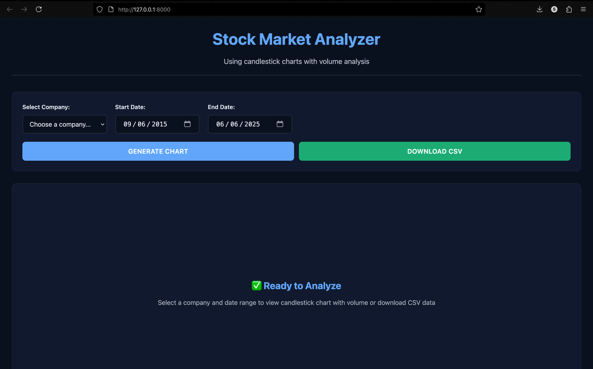
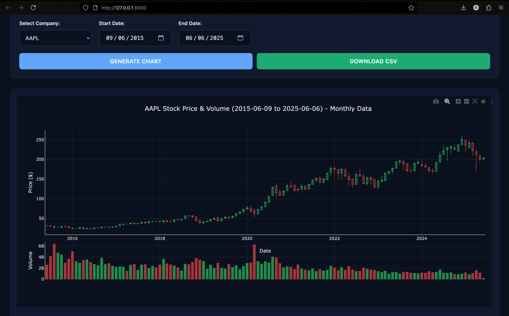
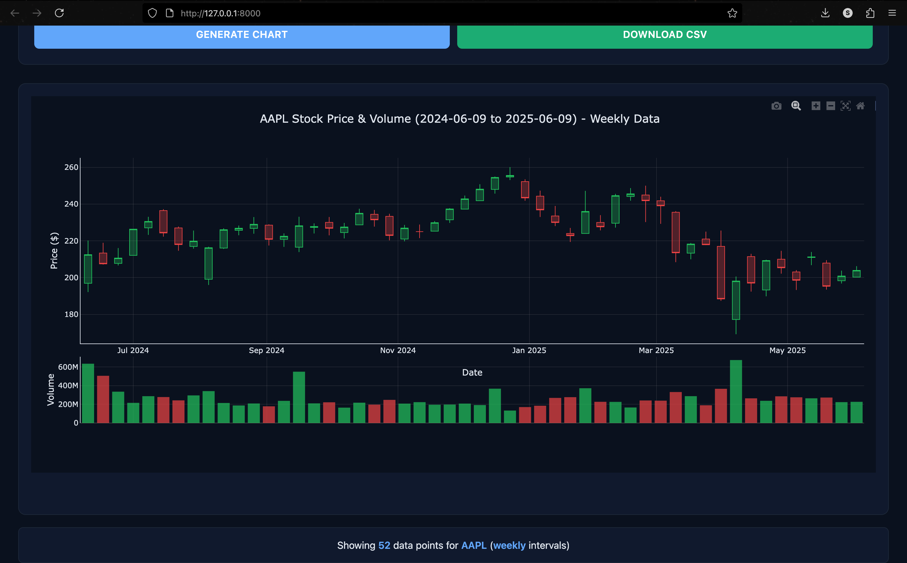
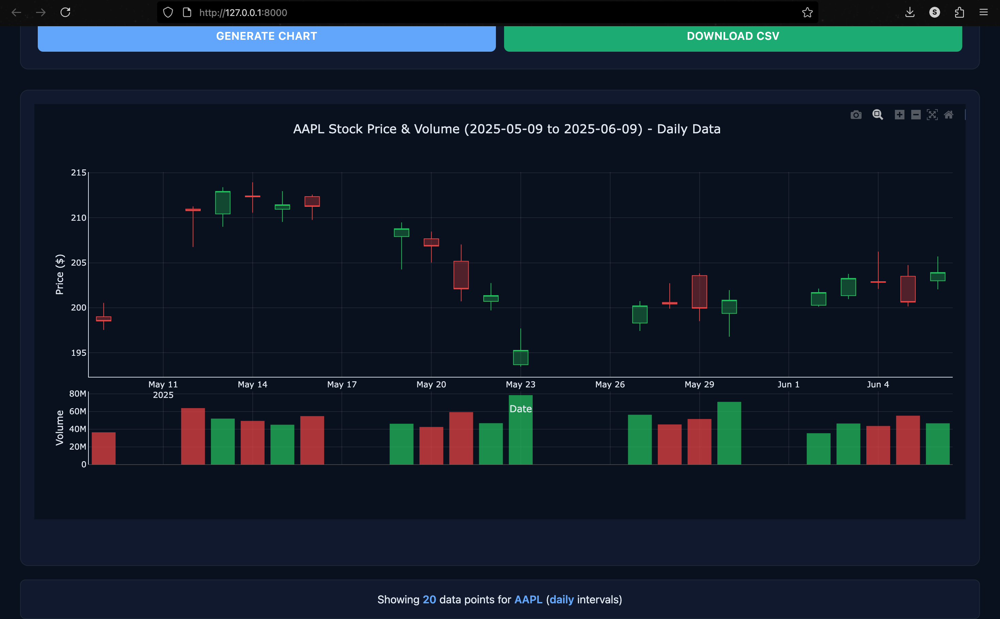

# Stock Market Analyzer

A Django-based web application for visualizing stock market data with interactive candlestick charts and volume analysis. Built with PostgreSQL database backend and containerized with Docker.

## Features

- **Interactive Candlestick Charts**: Professional-grade OHLC (Open, High, Low, Close) visualization using Plotly.js
- **Volume Analysis**: Color-coded volume bars showing market sentiment
- **Multiple Time Aggregations**: View data in daily, weekly, or monthly intervals
- **CSV Data Import**: Bulk import stock data from CSV files
- **Data Export**: Download filtered data as CSV
- **Responsive Design**: Works seamlessly across desktop and mobile devices
- **Docker Support**: Easy deployment with Docker and Docker Compose

## Screenshots

### Home Page



### Monthly Analysis



### Weekly Aggregation



### Daily View



## Technology Stack

- **Backend**: Django 4.x, Python 3.x
- **Database**: PostgreSQL
- **Frontend**: HTML5, CSS3, JavaScript
- **Visualization**: Plotly.js
- **Containerization**: Docker, Docker Compose
- **Web Server**: Nginx (production)

## Project Structure

```
STOCK_VIEWER/
├── docker-compose.yml          # Docker orchestration
├── Dockerfile                  # Django app container
├── nginx.conf                  # Nginx configuration
├── requirements.txt            # Python dependencies
├── manage.py                   # Django management script
├── load_data.py               # CSV import script
├── stock_viewer/              # Django project settings
│   ├── settings.py
│   ├── urls.py
│   └── wsgi.py
├── stocks/                    # Main Django app
│   ├── models.py             # Database models
│   ├── views.py              # View controllers
│   ├── urls.py               # URL routing
│   └── migrations/           # Database migrations
├── templates/stocks/          # HTML templates
│   └── index.html
├── static/                    # Static assets
│   ├── css/style.css
│   ├── js/script.js
│   └── images/               # Screenshots
├── StocksData/               # CSV data directory
└── .env                      # Environment variables
```

## Quick Start

### Prerequisites

- Docker and Docker Compose
- Python 3.8+ (for local development)
- Git

### 1. Clone the Repository

```bash
git clone <repository-url>
cd stock_viewer
```

### 2. Environment Setup

Create a `.env` file in the root directory:

```env
# Database Configuration
DB_NAME=stock_db
DB_USER=stock_user
DB_PASSWORD=your_secure_password
DB_HOST=db
DB_PORT=5432

# Django Configuration
SECRET_KEY=your-super-secret-django-key-here
DEBUG=True
```

### 3. Docker Deployment

```bash
# Build and start all services
docker-compose up --build

# Run in background
docker-compose up -d --build
```

The application will be available at `http://localhost:8080`

### 4. Import Stock Data

Place your CSV files in the `StocksData/` directory with the following format:

```csv
Date,Open,High,Low,Close/Last,Volume
01/03/2023,$150.20,$155.40,$149.80,$154.90,1250000
```

Run the data import script:

```bash
# Using Docker
docker-compose exec web python load_data.py

# Or locally
python load_data.py
```

## Development Setup

### Local Development

1. **Create Virtual Environment**:

```bash
python -m venv venv
source venv/bin/activate  # Linux/Mac
# or
venv\Scripts\activate     # Windows
```

2. **Install Dependencies**:

```bash
pip install -r requirements.txt
```

3. **Setup Database**:

```bash
# Make sure PostgreSQL is running locally
python manage.py makemigrations
python manage.py migrate
```

4. **Run Development Server**:

```bash
python manage.py runserver
```

## API Endpoints

### Chart Data API

- **URL**: `/api/chart-data/`
- **Method**: POST
- **Content-Type**: `application/json`

**Request Body**:

```json
{
  "company_id": 1,
  "start_date": "2023-01-01",
  "end_date": "2023-12-31",
  "aggregation": "daily"
}
```

**Response**:

```json
{
  "chart_data": {
    "dates": ["2023-01-01", "2023-01-02"],
    "opens": [150.2, 154.9],
    "highs": [155.4, 158.3],
    "lows": [149.8, 153.2],
    "closes": [154.9, 157.8],
    "volumes": [1250000, 1100000]
  },
  "data_points": 2,
  "company_name": "AAPL",
  "aggregation": "daily"
}
```

## Database Schema

### Companies Table

```sql
CREATE TABLE stocks_company (
    id SERIAL PRIMARY KEY,
    name VARCHAR(100) UNIQUE,
    symbol VARCHAR(10) UNIQUE,
    created_at TIMESTAMP DEFAULT CURRENT_TIMESTAMP
);
```

### Stock Data Table

```sql
CREATE TABLE ohlc_data (
    id SERIAL PRIMARY KEY,
    company_symbol VARCHAR(10),
    date DATE,
    open DECIMAL(10,2),
    high DECIMAL(10,2),
    low DECIMAL(10,2),
    close DECIMAL(10,2),
    volume BIGINT,
    file_source VARCHAR(50),
    created_at TIMESTAMP DEFAULT CURRENT_TIMESTAMP,
    UNIQUE(company_symbol, date)
);
```

## Data Import Format

Your CSV files should follow this format:

```csv
Date,Open,High,Low,Close/Last,Volume
01/03/2023,$150.20,$155.40,$149.80,$154.90,1250000
01/04/2023,$154.90,$158.30,$153.20,$157.80,1100000
```

**Supported formats**:

- Date format: `MM/DD/YYYY`
- Price columns can include `$` symbol (automatically cleaned)
- File naming: `COMPANY_SYMBOL.csv` (e.g., `AAPL.csv`)

### Docker Services

- **web**: Django application server
- **db**: PostgreSQL database
- **nginx**: Reverse proxy and static file server

## Troubleshooting

### Common Issues

1. **Database Connection Error**:

   - Ensure PostgreSQL is running
   - Check database credentials in `.env`
   - Verify network connectivity between containers

2. **CSV Import Fails**:

   - Check CSV format matches expected structure
   - Ensure date format is `MM/DD/YYYY`
   - Verify file permissions

3. **Chart Not Loading**:
   - Check browser console for JavaScript errors
   - Ensure API endpoint is accessible
   - Verify data exists for selected date range

### Logs

```bash
# View application logs
docker-compose logs web

# View database logs
docker-compose logs db

# Follow logs in real-time
docker-compose logs -f
```

## Future Enhancements

- **Real-time Data Integration**: Live market data feeds with WebSocket support for automatic price updates and streaming quotes
- **Technical Indicators**: RSI, MACD, Bollinger Bands, moving averages, and other momentum/volatility indicators
- **Portfolio Management Features**: Track multiple portfolios, transactions, performance analytics, and asset allocation
- **Comparison Tools**: Side-by-side chart comparisons, peer analysis, and performance benchmarking
- **User Authentication**: Secure login, personal dashboards, watchlists, and role-based access control
- **Machine Learning Capabilities**: Price forecasting, pattern recognition, sentiment analysis, and automated trading signals

## License

This project is licensed under the MIT License - see the [LICENSE](LICENSE) file for details.
